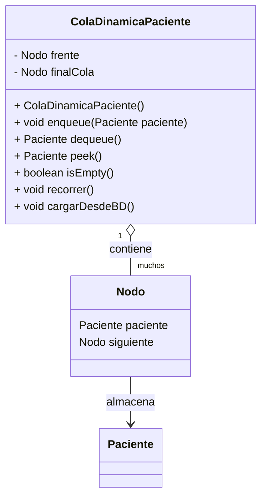

# Ejemplo de uso: ColaDinamicaPaciente

```java
import coladinamica.ColaDinamicaPaciente;
import clases.Paciente;

public class TestColaDinamicaPaciente {
    public static void main(String[] args) {
        ColaDinamicaPaciente cola = new ColaDinamicaPaciente();
        // Cargar pacientes desde la base de datos
        cola.cargarDesdeBD();
        // Recorrer la cola
        cola.recorrer();
        // Encolar un nuevo paciente (ejemplo)
        Paciente nuevo = new Paciente(/* completar datos del constructor */);
        cola.enqueue(nuevo);
        // Mostrar el primer paciente
        System.out.println("Primer paciente: " + cola.peek().getNombre());
        // Desencolar
        Paciente atendido = cola.dequeue();
        System.out.println("Paciente atendido: " + atendido.getNombre());
        // Recorrer nuevamente
        cola.recorrer();
    }
}
```

---

## Diagrama UML (Mermaid)

