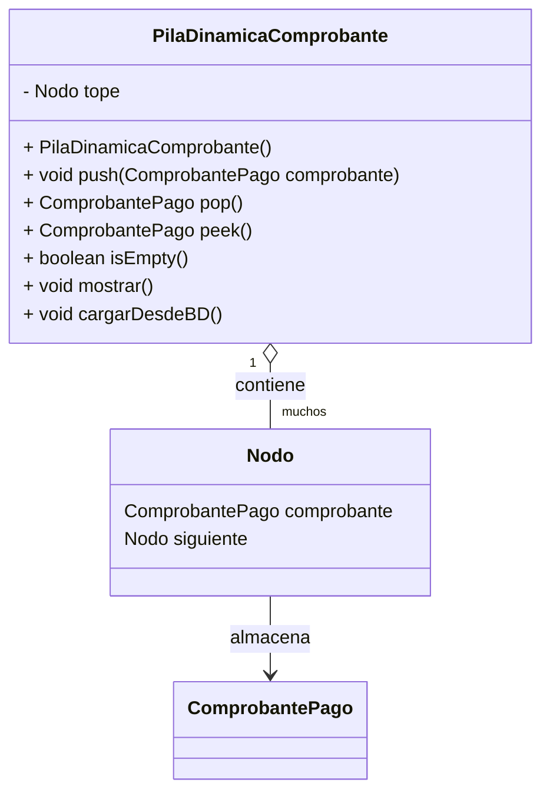

# Ejemplo de uso: PilaDinamicaComprobante

```java
import piladinamica.PilaDinamicaComprobante;
import clases.ComprobantePago;

public class TestPilaDinamicaComprobante {
    public static void main(String[] args) {
        PilaDinamicaComprobante pila = new PilaDinamicaComprobante();
        // Cargar comprobantes desde la base de datos
        pila.cargarDesdeBD();
        // Mostrar la pila
        pila.mostrar();
        // Apilar un nuevo comprobante (ejemplo)
        ComprobantePago nuevo = new ComprobantePago(/* completar datos del constructor */);
        pila.push(nuevo);
        // Mostrar el comprobante en la cima
        System.out.println("Comprobante en la cima: " + pila.peek().getIdComprobantePago());
        // Desapilar
        ComprobantePago procesado = pila.pop();
        System.out.println("Comprobante procesado: " + procesado.getIdComprobantePago());
        // Mostrar nuevamente
        pila.mostrar();
    }
}
```

---

## Diagrama UML (Mermaid)

